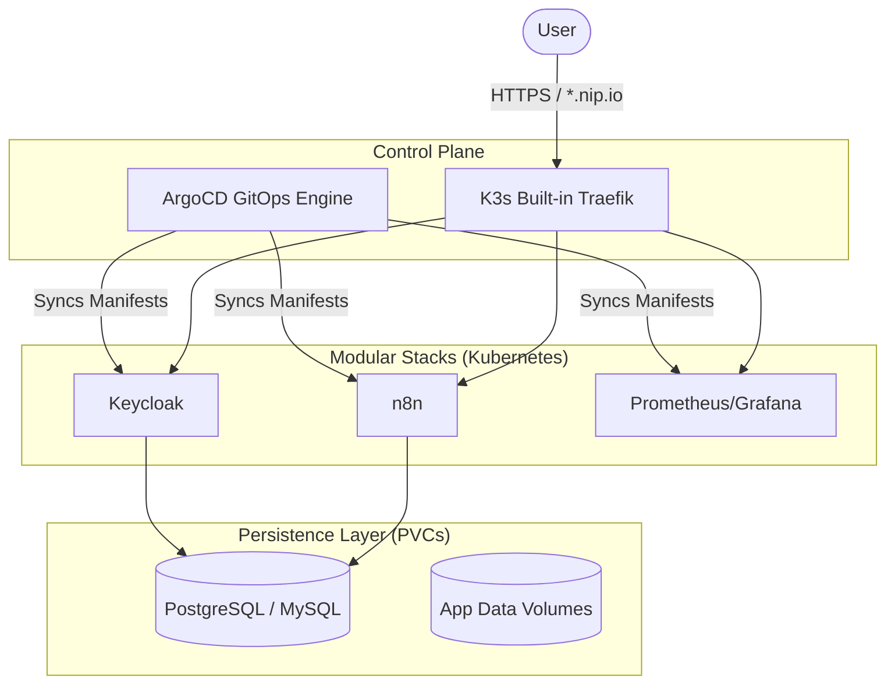

# ☁️ K3s-ArgoCD Sandbox
## A GitOps Local Cloud Architecture

A modular, automated infrastructure sandbox for testing cloud-native stacks, observability, and automation tools on your local machine using **K3s**, **ArgoCD**, and the **GitOps** paradigm.

> [!TIP]
> This lab mimics a production cloud environment built on top of Kubernetes, with modular application stacks synced automatically via ArgoCD.

## 🏗️ Architecture: The "GitOps Cloud" Design

Unlike standard local docker labs, **K3s-ArgoCD Sandbox** is built with a modern platform engineering mindset. It replaces imperative `docker-compose` commands with declarative Kubernetes manifests managed by ArgoCD.



## 🚀 Overview

This lab provides a "Sandboxed" Kubernetes environment. By utilizing `k3d`, we spin up a lightweight, fully functional K3s cluster. ArgoCD is then installed to automatically deploy all our infrastructure stacks directly from this Git repository.

---

## 📋 Prerequisites

### System Requirements
*   **Operating System**: macOS or Linux.
*   **Tools**:
    *   `docker` (Docker Desktop, Colima, or OrbStack)
    *   `k3d` (via `brew install k3d`)
    *   `kubectl` (via `brew install kubectl`)
    *   `make`

---

## 🏗️ Stack Catalog

The sandbox automatically deploys the following modular stacks:

| Category | Tools | Description |
| :--- | :--- | :--- |
| **GitOps Engine** | ArgoCD | Continuous delivery and sync agent |
| **Edge & Proxy** | Traefik | Built-in K3s ingress controller |
| **SSL/TLS** | Cert-Manager | Automated Certificate provisioning |
| **Observability** | Prometheus, Grafana | Metrics and Dashboards |
| **Automation** | n8n | Low-code workflow automation |
| **Databases** | PostgreSQL, MySQL | Stateful data persistence via PVCs |
| **Identity** | Keycloak | Identity and Access Management (OIDC/SAML) |
| **Management** | Adminer, phpMyAdmin | Database management UIs |

---

## 🛠️ Quick Start

### 1. Fork & Clone
ArgoCD requires a Git repository to sync manifests from. First, **fork** this repository, then clone it locally:
```bash
git clone https://github.com/YOUR_USERNAME/k3s-argocd-sandbox.git
cd k3s-argocd-sandbox
```

*(Note: You will need to update `argocd/bootstrap.yaml` to point to your fork's URL before committing).*

### 2. Setup Infrastructure
Launch the K3s cluster and install ArgoCD:
```bash
make up
```

### 3. Retrieve Credentials
Get your default ArgoCD admin password:
```bash
make password
```

### 4. Deploy the Stacks
Access the ArgoCD UI at `http://argocd.127.0.0.1.nip.io`. Log in with username `admin` and your retrieved password.
Deploy the master application by applying the bootstrap manifest:
```bash
kubectl apply -f argocd/bootstrap.yaml
```
ArgoCD will immediately detect the `apps/` directory and begin spinning up PostgreSQL, Keycloak, Prometheus, and everything else!

---

## 🔐 Handling Environment Variables & Secrets in GitOps

Here is how variables are managed in this Kubernetes architecture:

1. **Non-Sensitive Variables:** Standard configurations (like `DB_TYPE: postgres` or `TZ: UTC`) are defined directly in the `Deployment` manifests under the `env:` block.
2. **Global Domains:** The ingress domain (`127.0.0.1.nip.io`) is defined directly in the `Ingress` resources. If you want to use a custom domain, you would run a find-and-replace across the YAML files and push the commit.
3. **Sensitive Secrets:** Passwords and tokens are stored centrally in `apps/secrets.yaml` as base64 encoded strings. The Pods reference these securely using `valueFrom: secretKeyRef`. 
4. **SSL Certificates:** We use `cert-manager` to automatically provision certificates for all ingresses. Locally, it generates Self-Signed certificates (expect a "Not Secure" browser warning, but traffic is encrypted). If you attach a public domain, you can easily swap the `apps/cert-manager/issuer.yaml` to an ACME Let's Encrypt issuer to get fully valid green padlocks!

> [!WARNING]
> Because this is a local sandbox, `apps/secrets.yaml` is committed to Git with dummy passwords (e.g., `password`). **Never commit real production secrets to a public Git repository.** For a production environment, you would replace `secrets.yaml` with a tool like **Sealed Secrets** or **External Secrets Operator** (fetching from AWS/Azure/Vault).

---


## 🧪 Testing & Validation

The sandbox is designed to be environment-agnostic. Whether you are running on a local laptop or a remote VM, the GitOps workflow remains identical.

### 1. Domain & Access Strategy

| Scenario | Recommended Domain | Access Method |
| :--- | :--- | :--- |
| **Local Development** | `127.0.0.1.nip.io` | Automatic (via nip.io) |
| **Remote VM (Public IP)** | `<VM_IP>.nip.io` | Automatic (via nip.io) |
| **Public Domain** | `lab.yourdomain.com` | DNS Record (A or CNAME) |
| **Offline / Internal** | `lab.local` | `/etc/hosts` entry |

*(To change the domain for your stacks, run a global find-and-replace on `127.0.0.1.nip.io` in the `apps/` directory and commit to your fork. To change the ArgoCD dashboard URL during setup, simply run `APP_DOMAIN="my.domain.com" make up`).*

### 2. Universal Deployment Flow
To deploy on **any** machine (Local or Remote):
1.  **Fork & Clone**: Fork this repo and clone it locally.
2.  **Cluster Setup**: Run `make up` to build the K3s cluster. *(Or run `APP_DOMAIN="my.domain" make up`)*.
3.  **GitOps Sync**: Run `kubectl apply -f argocd/bootstrap.yaml`.

### 3. Remote VM Deployment
The sandbox is designed to be environment-agnostic. To deploy on a remote VM:
1.  **Fork & Clone**: Fork this repo and clone it onto your VM.
2.  **Configure Domain**: Replace all instances of `127.0.0.1.nip.io` with your VM's IP address (e.g., `<VM_IP>.nip.io`).
3.  **Launch**: Run `make up` and apply your bootstrap manifest.

---

## ➕ How to Add a New App

Adding a new tool to the GitOps flow is standardized:

1.  **Create Directory**: `mkdir -p apps/my-new-tool`
2.  **Add Manifests**: Create your `Deployment`, `Service`, and `Ingress` YAML files. Ensure the ingress uses your domain.
3.  **Commit & Push**: Commit the new folder to your GitHub fork.
4.  **Auto-Sync**: ArgoCD will detect the change within 3 minutes and automatically apply it!

---

## 📚 Content & Community

This project is part of a larger effort to share high-quality DevOps and Cloud Architecture patterns. 

- **Technical Article**: Deep dive into the "why" behind this architecture (available on Medium/LinkedIn).
- **Publishing Engine**: I use my standalone [Content-Ops](https://github.com/chinmaymjog/content-ops) tool to automate the transition of these docs to Medium and LinkedIn.

---
*Maintained by [Chinmay Jog](https://github.com/chinmaymjog)*
