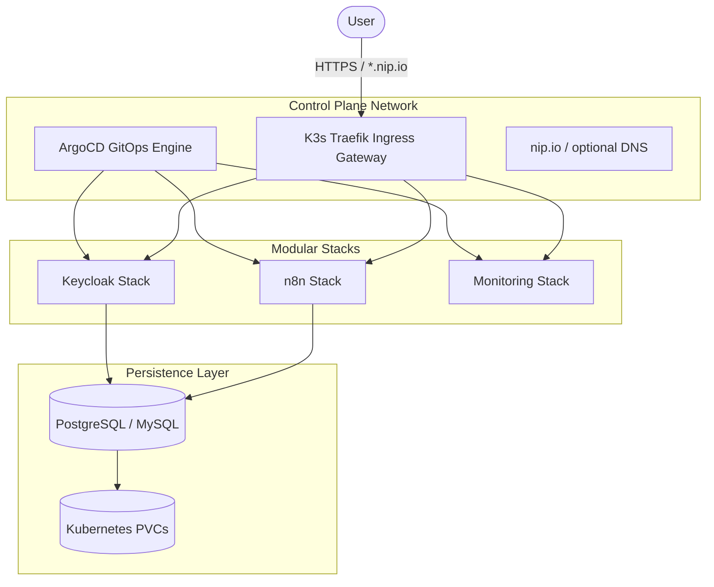

# ☁️ K3s-ArgoCD Sandbox
## A Production-Grade Local Cloud Architecture on Kubernetes

A modular, automated infrastructure sandbox for testing cloud-native stacks, observability, and automation tools on your laptop or a remote VM using K3s and ArgoCD.

> [!TIP]
> This lab mimics a production cloud environment with modular stacks and unified ingress.

## 🏗️ Architecture: The "GitOps Cloud" Design

Like cloudops-sandbox, this project keeps ingress, control-plane logic, and modular application stacks. The runtime model shifts from Docker Compose to Kubernetes manifests synced by ArgoCD.



## 🚀 Overview

This lab provides a "Sandboxed" environment that mimics a production cloud setup. It allows rapid deployment of stateful tools and management stacks using K3s, Traefik, and ArgoCD as the GitOps control plane.

## System Docs (Engineering Workflow)

- Project specification: docs/project-spec.md
- Architecture decisions: docs/architecture.md
- Execution tracker: docs/tasks.md

---

## 📋 Prerequisites

### System Requirements
*   **Operating System**: macOS or Linux.
*   **Docker runtime**: Docker Desktop, Colima, or OrbStack.
*   **Tools**: `k3d`, `kubectl`, `make`.

Install example (macOS):

```bash
brew install k3d kubectl
```

---

## 🏗️ Stack Catalog

The lab is organized into modular stacks:

| Category | Tools | Description |
| :--- | :--- | :--- |
| **GitOps Engine** | ArgoCD | Continuous delivery and sync agent |
| **Edge & Proxy** | Traefik | Built-in K3s ingress controller |
| **SSL/TLS** | Cert-Manager | Automated certificate provisioning |
| **Observability** | Prometheus, Grafana | Metrics and Dashboards |
| **Automation** | n8n | Low-code workflow automation |
| **Databases** | PostgreSQL, MySQL | Stateful data persistence via PVCs |
| **Identity** | Keycloak | Identity and Access Management (OIDC/SAML) |
| **Management** | Adminer, phpMyAdmin | Database management UIs |

---

## 🛠️ Quick Start

### 1. Fork & Clone
ArgoCD should sync from your fork:

```bash
git clone https://github.com/YOUR_USERNAME/k3s-argocd-sandbox.git
cd k3s-argocd-sandbox
```

Initialize local secret file:

```bash
cp .env.example .env
```

Edit `.env` with your own secret values.

### 2. Choose Setup Mode

#### Mode A (Recommended): Local Laptop with nip.io
Use local domain in this terminal:

```bash
export APP_DOMAIN=127.0.0.1.nip.io
```

Expected access examples:
- `http://argocd.127.0.0.1.nip.io`
- `https://grafana.127.0.0.1.nip.io`
- `https://keycloak.127.0.0.1.nip.io`
- `https://n8n.127.0.0.1.nip.io`

Note: nip.io mode uses sandbox certificates, so browser certificate warnings are expected.

#### Mode B: Remote VM with nip.io
Use VM-based domain in this terminal:

```bash
export APP_DOMAIN=<VM_PUBLIC_IP>.nip.io
```

VM preflight:
1. Open inbound ports `80` and `443` on the VM firewall/security group.
2. Ensure Docker is running on the VM.

Expected access examples:
- `http://argocd.<VM_PUBLIC_IP>.nip.io`
- `https://grafana.<VM_PUBLIC_IP>.nip.io`
- `https://keycloak.<VM_PUBLIC_IP>.nip.io`
- `https://n8n.<VM_PUBLIC_IP>.nip.io`

#### Mode C (Optional Advanced): Public Domain
Use this mode only if you want a custom DNS domain.

Set in terminal:

```bash
export APP_DOMAIN=lab.yourdomain.com
```

Then update app ingress hosts from `127.0.0.1.nip.io` to your domain before bootstrap.

### 3. Point Bootstrap to Your Fork
Update `argocd/bootstrap.yaml` and set `spec.source.repoURL` to your fork URL:
- `https://github.com/YOUR_USERNAME/k3s-argocd-sandbox.git`

### 4. Update App Domains (Remote/Public Modes)
Application manifests are currently checked in with `127.0.0.1.nip.io`.
For remote or public domain modes, replace domain values in `apps/`:

```bash
find apps -type f -name "*.yaml" -exec sed -i.bak "s/127.0.0.1.nip.io/${APP_DOMAIN}/g" {} +
find apps -type f -name "*.bak" -delete
```

### 5. Setup Infrastructure
Create the K3s cluster and install ArgoCD:

```bash
make up
```

### 6. Retrieve Credentials
Get the default ArgoCD admin password:

```bash
make password
```

Login username is `admin`.

### 7. Apply Secrets (Local, User-Controlled)

Apply Kubernetes secret from your local `.env`:

```bash
make secrets
```

### 8. Launch Stack
Bootstrap all application manifests:

```bash
kubectl apply -f argocd/bootstrap.yaml
```

### 9. Verify Health

```bash
make status
kubectl get ingress -A
```

### 10. First Login (Recommended)
Start with ArgoCD dashboard:
- `http://argocd.<APP_DOMAIN>`

Then verify core apps:
- `https://grafana.<APP_DOMAIN>`
- `https://keycloak.<APP_DOMAIN>`
- `https://n8n.<APP_DOMAIN>`

### 11. Onboard a New App

Use this flow for any new app manifest under `apps/<app-name>/`.

#### 11.1 Create app manifest

ArgoCD bootstraps `apps/` recursively, so any new manifest in that tree is synced automatically.

Template (`apps/<app-name>/<app-name>.yaml`):

```yaml
apiVersion: apps/v1
kind: Deployment
metadata:
  name: <app-name>
  namespace: default
spec:
  replicas: 1
  selector:
    matchLabels:
      app: <app-name>
  template:
    metadata:
      labels:
        app: <app-name>
    spec:
      containers:
        - name: <app-name>
          image: <image-repo>:<tag>
          ports:
            - containerPort: 80
          env:
            - name: APP_DOMAIN
              valueFrom:
                secretKeyRef:
                  name: sandbox-secrets
                  key: APP_DOMAIN
            - name: APP_DB_PASSWORD
              valueFrom:
                secretKeyRef:
                  name: sandbox-secrets
                  key: APP_DB_PASSWORD
---
apiVersion: v1
kind: Service
metadata:
  name: <app-name>
  namespace: default
spec:
  selector:
    app: <app-name>
  ports:
    - port: 80
      targetPort: 80
---
apiVersion: networking.k8s.io/v1
kind: Ingress
metadata:
  name: <app-name>
  namespace: default
  annotations:
    cert-manager.io/cluster-issuer: letsencrypt
spec:
  ingressClassName: traefik
  tls:
    - hosts:
        - <app-name>.<APP_DOMAIN>
      secretName: <app-name>-tls
  rules:
    - host: <app-name>.<APP_DOMAIN>
      http:
        paths:
          - path: /
            pathType: Prefix
            backend:
              service:
                name: <app-name>
                port:
                  number: 80
```

#### 11.2 Add/update local secret values

Add required keys to local `.env`, then apply:

```bash
make secrets
```

If the app needs a new key (example `APP_DB_PASSWORD`), add it to:

- `.env.example`
- `scripts/apply-secrets.sh` required keys list
- your local `.env`

#### 11.3 Commit and sync

Commit and push the new manifest(s). ArgoCD then reconciles the cluster from Git.

#### 11.4 Verify app rollout

```bash
kubectl rollout status deployment/<app-name> -n default --timeout=300s
kubectl get pods -n default -l app=<app-name>
kubectl get ingress <app-name> -n default
```

#### 11.5 DB-backed app extension (PostgreSQL/MySQL)

When the app needs a dedicated DB/user:

1. Add password key in local `.env` (example: `DEMO_DB_PASSWORD=...`).
2. Add the same key in `.env.example` and `scripts/apply-secrets.sh`, then run `make secrets`.
3. In `apps/pgsql/pgsql.yaml` or `apps/mysql/mysql.yaml`, add DB container env wiring from `sandbox-secrets`.
4. Add provisioning line in DB init script ConfigMap:
	 - PostgreSQL: `create_user_and_database "demo" "demo" "${DEMO_DB_PASSWORD}"`
	 - MySQL: `create_user_and_database "demo" "demo" "${DEMO_DB_PASSWORD}"`
5. Re-apply changed DB manifest and rollout restart DB deployment.
6. Run init script in the running DB pod to provision new DB/user without resetting data.

PostgreSQL validation:

```bash
kubectl exec -n default deployment/pgsql -- sh -lc 'export PGPASSWORD="$POSTGRES_PASSWORD"; psql -U postgres -d postgres -tAc "SELECT 1 FROM pg_database WHERE datname = '\''demo'\'';"; psql -U postgres -d postgres -tAc "SELECT 1 FROM pg_roles WHERE rolname = '\''demo'\'';"'
```

MySQL validation:

```bash
kubectl exec -n default deployment/mysql -- sh -lc 'mysql -N -u root -p"$MYSQL_ROOT_PASSWORD" -e "SELECT SCHEMA_NAME FROM INFORMATION_SCHEMA.SCHEMATA WHERE SCHEMA_NAME=\"demo\"; SELECT User FROM mysql.user WHERE User=\"demo\";"'
```

---

## 🔌 Optional Integrations

- Optional: replace plain Kubernetes Secrets with a secret manager flow (for example External Secrets or Sealed Secrets) when moving beyond local sandbox usage.
- Optional: configure cert-manager with your preferred issuer for trusted public certificates.

### Secure Remote Git Usage

For shared or public Git repositories:

1. Do not commit real values to Git.
2. Keep sensitive values only in local `.env` and apply via `make secrets`.
3. For team/remote environments, use encrypted GitOps secrets:
	- Sealed Secrets (recommended for this stack), or
	- External Secrets Operator with a cloud secret manager.

Current baseline in this repo keeps secret values out of tracked manifests and in user-controlled local env files.

---

## 🧰 Helpful Commands

```bash
make up        # create k3d cluster and install ArgoCD
make down      # stop and delete the k3d cluster
make status    # cluster and pod status snapshot
make password  # print ArgoCD admin password
```

---
*Maintained by [Chinmay Jog](https://github.com/chinmaymjog) | 📖 [Read my articles on Medium](https://medium.com/@chinmaymjog)*
