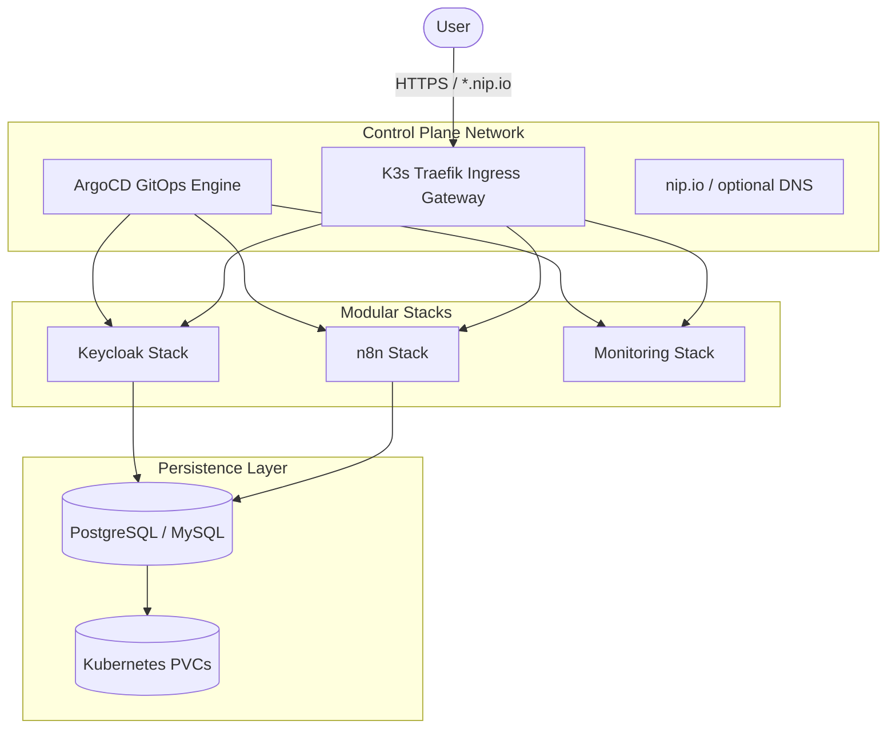

# ☁️ K3s-ArgoCD Sandbox
## A Production-Grade Local Cloud Architecture on Kubernetes

A modular, automated infrastructure sandbox for testing cloud-native stacks, observability, and automation tools on your laptop or a remote VM using K3s and ArgoCD.

> [!TIP]
> This lab mimics a production cloud environment with modular stacks and unified ingress.

> [!NOTE]
> `k3s-argocd-sandbox` is the next step after `cloudops-sandbox`: the same modular lab concept, but moved from Docker Compose to Kubernetes plus ArgoCD so the deployment model matches a GitOps workflow.

## 🏗️ Architecture: The "GitOps Cloud" Design

Like cloudops-sandbox, this project keeps ingress, control-plane logic, and modular application stacks. The runtime model shifts from Docker Compose to Kubernetes manifests synced by ArgoCD.

The design intentionally preserves the mental model from `cloudops-sandbox`:
- one ingress entry point
- modular service directories
- shared runtime inputs
- simple lifecycle commands

The implementation changed from Compose stacks to Kubernetes resources, but the operator experience is meant to feel like the same lab at a higher fidelity layer.


```mermaid
graph TD
	User([User]) -->|HTTPS / *.nip.io| Traefik[K3s Traefik Ingress Gateway]

	subgraph "Control Plane Network"
		Traefik
		ArgoCD[ArgoCD GitOps Engine]
		DNS[nip.io / optional DNS]
	end

	subgraph "Modular Stacks"
		App1[Keycloak Stack]
		App2[n8n Stack]
		App3[Monitoring Stack]
	end

	subgraph "Persistence Layer"
		DB[(PostgreSQL / MySQL)]
		Vol[(Kubernetes PVCs)]
	end

	ArgoCD --> App1
	ArgoCD --> App2
	ArgoCD --> App3

	Traefik --> App1
	Traefik --> App2
	Traefik --> App3

	App1 --> DB
	App2 --> DB

	DB --> Vol
```

## 🚀 Overview

This lab provides a "Sandboxed" environment that mimics a production cloud setup. It allows rapid deployment of stateful tools and management stacks using K3s, Traefik, and ArgoCD as the GitOps control plane.

## System Docs (Engineering Workflow)

- Project specification: docs/project-spec.md
- Architecture decisions: docs/architecture.md
- Execution tracker: docs/tasks.md

---

## 📋 Prerequisites

### System Requirements
*   **Operating System**: Linux host or Linux VM with `systemd`, `sudo`, and `kubectl`.
*   **Tools**: `git`, `curl`, `make`.
*   **Ports**: `80` and `443` available on the host for Traefik ingress.
*   **Tested K3s version**: `v1.36.1+k3s1`

Install example (Debian/Ubuntu):

```bash
sudo apt-get update
sudo apt-get install -y git curl make kubectl
```

---

## 🏗️ Stack Catalog

The lab is organized into modular apps. **Core** apps sync automatically with
the `sandbox-apps` Application; **optional** apps live under
`apps/optional/<group>/` with their own ArgoCD Application and only deploy
when you apply it — see [Optional Stack Groups](#-optional-stack-groups).

| Tier | Category | Tools | Description |
| :--- | :--- | :--- | :--- |
| Core | GitOps Engine | ArgoCD | Continuous delivery and sync agent |
| Core | Edge & Proxy | Traefik | Built-in K3s ingress controller |
| Core | SSL/TLS | Cert-Manager | Automated certificate provisioning |
| Core | Databases | PostgreSQL | Stateful data persistence via PVCs (backs Grafana and n8n) |
| Core | Observability | Prometheus, Grafana | Metrics and Dashboards |
| Core | Automation | n8n | Low-code workflow automation |
| Optional (`identity`) | Identity | Keycloak | Identity and Access Management (OIDC/SAML) |
| Optional (`db-admin`) | Databases | MySQL, Adminer, phpMyAdmin | A second DB engine plus web-based DB admin UIs |

### 🔀 Optional Stack Groups

`make bootstrap` deploys only the core apps above - a lean first cluster
with fewer workloads, fewer secrets to fill in, and less exposed surface.
Add an optional group any time by applying its ArgoCD Application:

```bash
kubectl apply -f argocd/optional/identity.yaml    # + Keycloak
kubectl apply -f argocd/optional/db-admin.yaml    # + MySQL, Adminer, phpMyAdmin
```

Each is a separate ArgoCD Application (`sandbox-apps-identity`,
`sandbox-apps-db-admin`) syncing `apps/optional/<group>/` with the same
`automated: {prune: true, selfHeal: true}` policy as the core app, so once
applied it stays in sync like everything else. Remove a group with
`kubectl delete -f argocd/optional/<group>.yaml` (add `-n argocd` if not
already set in your context) - this deletes the Application and, per its
prune policy, the resources it owns.

`make configure` regenerates the runtime/image mirrors for optional groups
too, so their host names and image pins stay in sync with `.env` even
before you've applied them.

Secrets for optional groups still need real values in `.env` before you
apply them the first time - `MYSQL_ROOT_PASSWORD`, `KEYCLOAK_DB_PASSWORD`,
and `KEYCLOAK_ADMIN_PASSWORD` only matter once you bring those groups up,
but `make secrets` applies all of them together regardless.

---

## 🛠️ Quick Start

Start here if you just want the working path:

1. clone the repo
2. copy `.env.example` to `.env`
3. edit `.env`
4. run `make configure`
5. run `make bootstrap` (deploys the core apps - see [Optional Stack
   Groups](#-optional-stack-groups) to add Keycloak or MySQL/Adminer/phpMyAdmin)
6. run `make password` and `make status`

### What You Edit

Only edit `.env` for normal setup and customization.

`make configure` reads `.env` and regenerates the Kustomize mirror files used by the cluster.

### 1. Fork and Clone
Clone your fork of the repository:

```bash
git clone https://github.com/YOUR_USERNAME/k3s-argocd-sandbox.git
cd k3s-argocd-sandbox
```

Create the local secret file:

```bash
cp .env.example .env
```

Edit `.env` with your runtime values, image pins, and secret values.

> [!IMPORTANT]
> `REPO_URL` must be reachable from two places:
> - the shell running `make bootstrap`
> - ArgoCD inside the cluster
>
> If your fork is private, configure Git credentials for both places or use a public fork.

### 2. Configure Runtime Values
Write the values in `.env` for your environment:

```bash
make configure
```

This command does two things:
1. validates `.env`
2. regenerates the Kustomize mirror files in `apps/` and `argocd/`

If you want to change the host name strategy, change `APP_DOMAIN` in `.env` and run `make configure` again.
If you want to use a different repo or branch, change `REPO_URL` or `TARGET_REVISION` in `.env` and run `make configure` again.
If you want to pin different container versions, edit the image variables in `.env` and run `make configure` again.

> [!IMPORTANT]
> **Commit and push all the generated files** (`config/runtime.env`,
> `apps/runtime.env`, `argocd/runtime.env`, `config/images.env`,
> `apps/images.env`, and the same five under each
> `apps/optional/<group>/` you use) before running `make bootstrap` or
> `make sync`. ArgoCD syncs from the Git remote at `TARGET_REVISION`,
> not your local filesystem - it has no way to see what `make configure`
> just wrote unless those changes are pushed. Running `make configure`
> with a custom `APP_DOMAIN` but skipping this step is the #1 cause of
> "ArgoCD says Synced but the Ingress host is still `127.0.0.1.nip.io`" -
> the sync succeeded, it just synced the old committed values.
> `make check-config` (also run by `make up`/`make bootstrap`) warns if
> these files have local changes that aren't committed yet.

### 3. Choose One Setup Target
Pick exactly one of these. Do not mix them.

#### Option A: Local laptop with `nip.io`

Use this option if you want the lab on your laptop and do not want to manage DNS.

Expected access examples (core apps):
- `http://argocd.127.0.0.1.nip.io`
- `https://grafana.127.0.0.1.nip.io`
- `https://n8n.127.0.0.1.nip.io`

Add `https://keycloak.127.0.0.1.nip.io` once you apply the `identity`
optional group (see [Optional Stack Groups](#-optional-stack-groups)).

Browser certificate warnings are expected in this mode.

#### Option B: Remote VM with `nip.io`
Use this option if the cluster runs on a remote VM and you can open ports `80` and `443`.

Before running `make bootstrap`, confirm:
1. Open inbound ports `80` and `443` on the VM firewall/security group.
2. Ensure ports `80` and `443` are available on the VM host.

Expected access examples (core apps):
- `http://argocd.<VM_PUBLIC_IP>.nip.io`
- `https://grafana.<VM_PUBLIC_IP>.nip.io`
- `https://n8n.<VM_PUBLIC_IP>.nip.io`

Add `https://keycloak.<VM_PUBLIC_IP>.nip.io` once you apply the `identity`
optional group (see [Optional Stack Groups](#-optional-stack-groups)).

Browser certificate warnings are expected in this mode.

#### Option C: Public domain
Use this option only if you already control DNS and want to manage a real domain.

Before running `make bootstrap`, confirm:
1. `APP_DOMAIN` resolves to the host running K3s.
2. Your DNS provider or certificate setup matches your chosen cluster setup.

### 4. Bootstrap the Cluster
Install or reuse K3s, apply secrets, and bootstrap ArgoCD:

```bash
make bootstrap
```

To test a different K3s release:

```bash
make bootstrap K3S_VERSION=v1.35.5+k3s1
```

This runs:
1. `make up`
2. `make secrets`
3. `make sync`

The cluster bootstrap is intentionally split this way:
- `make up` installs or reuses K3s and installs ArgoCD
- `make secrets` creates the sandbox secret set from `.env`
- `make sync` applies the ArgoCD bootstrap application

First bootstrap on a fresh host can take several minutes because K3s, Cert-Manager, and ArgoCD images must be pulled.
If a rollout is slow, increase the wait:

```bash
make bootstrap ROLLOUT_TIMEOUT=1200s
```

### 5. Retrieve Credentials
Get the default ArgoCD admin password:

```bash
make password
```

Login username is `admin`.

### 6. Verify Health

```bash
make status
kubectl get ingress -A
kubectl get application sandbox-apps -n argocd
```

### 7. First Login
Start with the ArgoCD dashboard:

- `http://argocd.<your-domain>`

Then verify core apps:

- `https://grafana.<your-domain>`
- `https://n8n.<your-domain>`

### 8. Customize the Lab

Use this table if you want to change the default behavior without guessing which file matters.

| Change | Edit this file | Run after editing |
| :--- | :--- | :--- |
| Hostname/domain | `.env` | `make configure` |
| Repo URL / branch | `.env` | `make configure` |
| Image tags | `.env` | `make configure` |
| App manifest behavior | `apps/<app-name>/*.yaml` (core) or `apps/optional/<group>/*.yaml` | `make configure` if host/image wiring changed |
| ArgoCD bootstrap repo path | `argocd/bootstrap.yaml` | `kubectl apply -k argocd` or `make sync` |
| Optional group membership | `argocd/optional/<group>.yaml` | `kubectl apply -f argocd/optional/<group>.yaml` |

### 9. Onboard a New App

A new app is either core (always deployed) or optional (its own opt-in
group). Core is simpler; use optional if the app is niche enough that not
everyone bootstrapping the lab should get it by default.

**Core app** — use this flow for a new app under `apps/<app-name>/`:

1. Add the Kubernetes manifests under `apps/<app-name>/`.
2. Add the new manifest path to the `resources:` list in `apps/kustomization.yaml` — Kustomize does not auto-discover files, so a manifest that isn't listed there is never applied, even though it lives under `apps/`.
3. If the app needs a custom host name, add the host to `.env` and map it in `apps/kustomization.yaml`.
4. If the app needs a custom image tag, add it to `.env` and map it in `apps/kustomization.yaml`.
5. Run `make configure`.
6. Commit the manifest changes together with the config updates.

**Optional app** — either add it to an existing group under
`apps/optional/<group>/` (same steps as above, but edit
`apps/optional/<group>/kustomization.yaml` instead), or start a new group:

1. Create `apps/optional/<new-group>/` with the app's manifests and a
   `kustomization.yaml` (see `apps/optional/identity/kustomization.yaml`
   for a minimal example) — resources and `configMapGenerator` envs files
   must stay inside this directory; Kustomize refuses to reach outside it.
2. Add `<new-group>` to `OPTIONAL_GROUPS` in `scripts/configure-runtime.sh`
   so `make configure` writes its `runtime.env`/`images.env` mirrors.
3. Copy `argocd/optional/identity.yaml` to `argocd/optional/<new-group>.yaml`,
   updating the Application `name` and `spec.source.path`.
4. Document the new group in the Stack Catalog and Optional Stack Groups
   sections above.

If the app exposes a host, add a matching replacement entry in the
relevant `kustomization.yaml` and a corresponding host value in `.env`.

If the app needs a pinned image managed centrally, add a new `*_IMAGE`
entry to `.env`, run `make configure`, and add the corresponding
replacement rule in the relevant `kustomization.yaml`.

### 10. Add or Update Local Secret Values

Add required keys to local `.env`, then apply:

```bash
make secrets
```

If the app needs a new key, add it to:

- `.env.example`
- `scripts/apply-secrets.sh`
- your local `.env`

### 11. Commit and Sync

Commit and push the manifest changes together with any runtime or image file changes in `config/`, `apps/`, and `argocd/`. ArgoCD then reconciles the cluster from Git.

### 12. Verify App Rollout

```bash
kubectl rollout status deployment/<app-name> -n default --timeout=300s
kubectl get pods -n default -l app=<app-name>
kubectl get ingress <app-name> -n default
```

### 13. DB-Backed App Extension

This is optional and only needed when you add a database-backed app.

When the app needs a dedicated DB/user:

1. Add password key in local `.env` (example: `DEMO_DB_PASSWORD=...`).
2. Add the same key in `.env.example` and `scripts/apply-secrets.sh`, then run `make secrets`.
3. In `apps/pgsql/pgsql.yaml` (core) or `apps/optional/db-admin/mysql.yaml` (optional), add DB container env wiring from `sandbox-secrets`.
4. Add provisioning line in DB init script ConfigMap:
   - PostgreSQL: `create_user_and_database "demo" "demo" "${DEMO_DB_PASSWORD}"`
   - MySQL: `create_user_and_database "demo" "demo" "${DEMO_DB_PASSWORD}"`
5. Re-apply changed DB manifest and rollout restart DB deployment.
6. Run init script in the running DB pod to provision new DB/user without resetting data.

PostgreSQL validation:

```bash
kubectl exec -n default deployment/pgsql -- sh -lc 'export PGPASSWORD="$POSTGRES_PASSWORD"; psql -U postgres -d postgres -tAc "SELECT 1 FROM pg_database WHERE datname = '\''demo'\'';"; psql -U postgres -d postgres -tAc "SELECT 1 FROM pg_roles WHERE rolname = '\''demo'\'';"'
```

MySQL validation:

```bash
kubectl exec -n default deployment/mysql -- sh -lc 'mysql -N -u root -p"$MYSQL_ROOT_PASSWORD" -e "SELECT SCHEMA_NAME FROM INFORMATION_SCHEMA.SCHEMATA WHERE SCHEMA_NAME=\"demo\"; SELECT User FROM mysql.user WHERE User=\"demo\";"'
```

---

## 🔌 Optional Integrations

- Optional: replace plain Kubernetes Secrets with a secret manager flow (for example External Secrets or Sealed Secrets) when moving beyond local sandbox usage.
- Optional: configure cert-manager with your preferred issuer for trusted public certificates.

### Secure Remote Git Usage

For shared or public Git repositories:

1. Do not commit real values to Git.
2. Keep sensitive values only in local `.env` and apply via `make secrets`.
3. For team/remote environments, use encrypted GitOps secrets:
	- Sealed Secrets (recommended for this stack), or
	- External Secrets Operator with a cloud secret manager.

Current baseline in this repo keeps secret values out of tracked manifests and in user-controlled local env files.

---

## 🧰 Helpful Commands

```bash
make up        # install or reuse k3s and install ArgoCD
make bootstrap # install k3s, apply secrets, and bootstrap ArgoCD apps
make sync      # re-apply the ArgoCD bootstrap application
make down CONFIRM_K3S_UNINSTALL=true  # uninstall k3s from the host
make status    # cluster and pod status snapshot
make password  # print ArgoCD admin password
```

---
*Maintained by [Chinmay Jog](https://github.com/chinmaymjog) | 📖 [Read my articles on Medium](https://medium.com/@chinmaymjog)*
