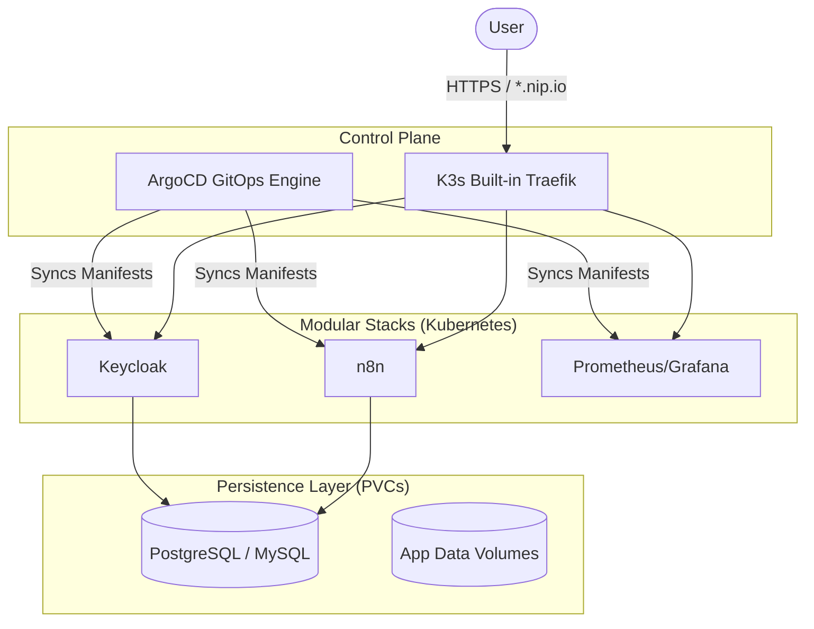

# Building a Production-Grade GitOps Sandbox on Your Laptop
## Evolving from Docker Compose to a K3s-ArgoCD Cloud

### Introduction
As a Cloud Infrastructure Architect, local testing is critical. A while ago, I built a modular Docker Compose sandbox to replicate production topologies. But let's face it: the industry has moved on. If you want to accurately model a modern, cloud-native enterprise environment, `docker-compose up` doesn't cut it anymore. 

You need Kubernetes, and more importantly, you need **GitOps**.

I wanted to take my local lab to the next level. I wanted a lightweight Kubernetes cluster, automated deployments driven by Git, unified ingress, and declarative state management.

This is how I built the **K3s-ArgoCD Sandbox**—a fully functional GitOps cloud running right on my laptop.

---

### The Architecture: A "GitOps Cloud" Design
Most local Kubernetes labs involve manually running `kubectl apply` over and over. I treated this as a platform engineering problem. Git is the single source of truth.

#### 🏗️ The App-of-Apps Pattern
By installing ArgoCD into a lightweight K3s cluster, I implemented the **App-of-Apps** pattern. A single `bootstrap.yaml` manifest tells ArgoCD to watch the `apps/` directory in the repository. When a new Kubernetes Deployment or Ingress is committed to Git, ArgoCD can reconcile the cluster state to match.

In practice, the repo now centralizes non-secret runtime inputs in a tracked config file so bootstrap and ArgoCD stay aligned. Local operators still apply their own secrets from `.env`, but they no longer need to rewrite manifests by hand for domain or repo URL changes.

#### 🛡️ Unified Ingress & Cert-Manager
Accessing services via `NodePort` is a friction point. I utilized the built-in Traefik ingress controller that ships with K3s.
- **Automated TLS for the sandbox**: `cert-manager` is available for certificate workflows, while the repo README documents the local `nip.io` flow and the extra steps needed if you want to move to a custom domain.
- **Zero-Config Routing**: I used **nip.io** for instant, domain-based routing (e.g., `https://grafana.127.0.0.1.nip.io`) without manual DNS or `/etc/hosts` edits.

#### 🐘 Idempotent Database Bootstrapping
One of the hardest parts of a local Kubernetes lab is managing database credentials and users declaratively. I developed a ConfigMap-based initialization workflow:
- **On-Initial-Boot**: Scripts mounted via ConfigMaps into `/docker-entrypoint-initdb.d` provision all databases and users automatically when the Persistent Volume Claim (PVC) is first created.
- **Idempotency**: Using `IF NOT EXISTS` logic means you can manually re-trigger the script inside the pod to add a new app database on the fly without destroying existing data.

The current repo also separates secret values from tracked manifests. Local users keep values in `.env`, apply them through `make secrets`, and can later move to a GitOps-safe encrypted secret pattern for remote or shared environments.

---

### Key Technical Features
- **Server-Side Apply**: Working with massive CRDs (like ArgoCD's ApplicationSet) often breaks standard `kubectl apply` due to annotation size limits. I automated the ArgoCD installation using `--server-side --force-conflicts` to guarantee a smooth bootstrap.
- **User-Controlled Local Secrets**: Passwords and tokens are supplied from a local `.env` file and applied into `sandbox-secrets`, keeping real values out of tracked manifests.
- **Developer Experience (DX)**: The entire lifecycle is abstracted via a minimalist Makefile:
    - `make configure`: Write the tracked runtime config for domain and repo URL.
    - `make up`: Install or reuse a pinned K3s release and install ArgoCD.
    - `make bootstrap`: Apply secrets and bootstrap the ArgoCD app-of-apps.
    - `make password`: Fetch the initial ArgoCD admin password.
    - `make secrets`: Apply local secret values into the cluster.

---

### Why This Matters
For a Cloud Architect or DevOps Engineer, building a GitOps workflow from scratch is the ultimate proof of concept. Building it with these production patterns—declarative configuration, automated reconciliation, and built-in TLS—doesn't just make your local testing faster; it demonstrates the exact architectural thinking required to manage enterprise-scale Kubernetes environments.

---

### Check out the Project
The full source code and setup instructions are available on GitHub:
👉 **[K3s-ArgoCD-Sandbox on GitHub](https://github.com/chinmaymjog/k3s-argocd-sandbox)**

Start with the README for the current local or remote setup flow, then use the docs set for architecture notes and tracked tasks.

---
*About the Author: Chinmay Jog is a Cloud Infrastructure Architect and DevOps Engineer. He specializes in building automated, secure, and developer-friendly infrastructure solutions.*
